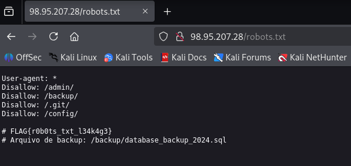
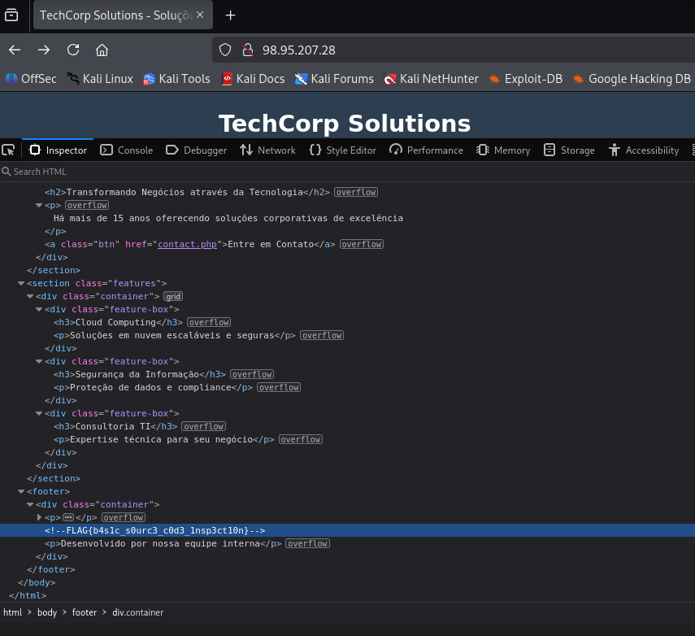
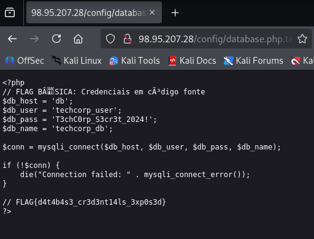
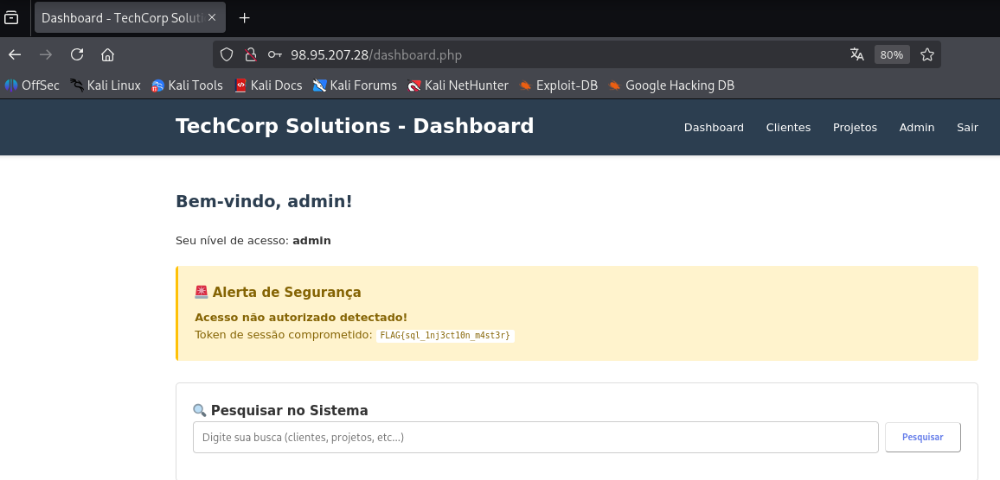
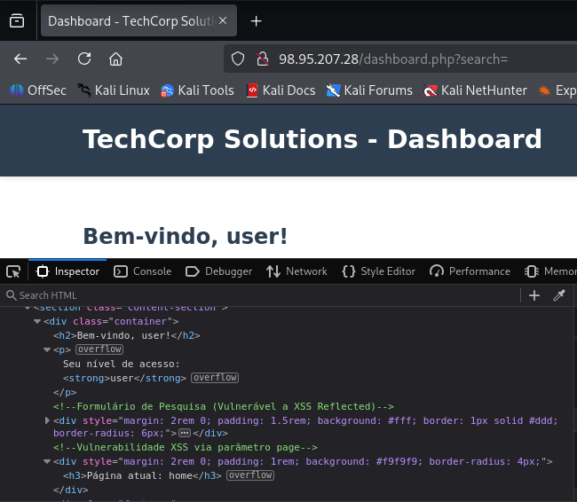
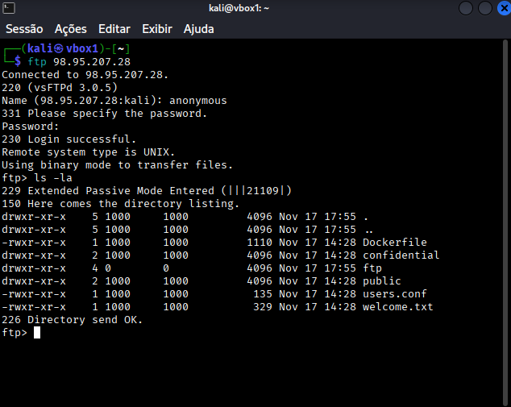

# RELATÓRIO DE TESTE DE INTRUSÃO (PENTEST)

**Cliente:** TechCorp Solutions

**Alvo Principal:** Infraestrutura & Web Host (IP: 98.95.207.28)

**Modalidade:** Black Box (Simulação de Ameaça Externa)

**Data da Execução:** 30/11/2025

**Data da Revisão:** 08/12/2025

**Autor:** Emily Carla

**Classificação:** **CONFIDENCIAL**

---

## 1\. Sumário Executivo

### 1.1 Objetivo

O presente teste de intrusão teve como objetivo simular um ataque cibernético externo (*Black Box*) contra a infraestrutura da **TechCorp Solutions**, especificamente no servidor hospedado em `98.95.207.28`. O foco principal foi identificar vulnerabilidades exploráveis na aplicação web e serviços expostos que pudessem comprometer a confidencialidade e integridade dos dados corporativos.

### 1.2 Resumo dos Resultados

A avaliação identificou um cenário de **Risco Crítico**. A equipe de auditoria obteve êxito no comprometimento da aplicação web e identificou exposições severas de informações sensíveis. Falhas de configuração e injeção de código permitiram o acesso administrativo não autorizado e o vazamento de credenciais de banco de dados e controle de versão.

**Principais Vetores de Comprometimento:**

- **Web:** Injeção de SQL (SQLi) permitindo *Bypass* de autenticação e Cross-Site Scripting (XSS).
- **Information Disclosure:** Exposição de arquivos de configuração, backups e credenciais em texto claro.
- **Infraestrutura:** Serviço FTP configurado com acesso anônimo permitindo listagem de diretórios.

---

## 2\. Metodologia & Escopo

### 2.1 Metodologia

O teste foi conduzido seguindo os padrões do **PTES (Penetration Testing Execution Standard)** e **OWASP Top 10**, utilizando a metodologia *Cyber Kill Chain* para estruturar o ataque:

1. **Reconhecimento:** Coleta de informações passiva e ativa para mapear a superfície de ataque.
2. **Exploração:** Uso de vulnerabilidades identificadas para obter acesso inicial e administrativo.
3. **Análise de Riscos:** Classificação e documentação dos impactos de negócio.

**Ferramentas Utilizadas (Kali Linux):**

- **Reconhecimento:** Nmap, Gobuster, Browser DevTools.
- **Exploração:** Clientes FTP, Manipulação de requisições HTTP.

### 2.2 Escopo

- **Alvo:** `http://98.95.207.28/`
- **Serviços:** Web (Porta 80), FTP (Porta 21).
- **Tipo:** Black Box (sem credenciais ou documentação prévia).

---

## 3\. Registro das Flags Capturadas

Abaixo listam-se as *flags* capturadas durante a intrusão, comprovando o acesso indevido a arquivos e áreas restritas.

| Flag Capturada | Data | Localização/Vetor |
| --- | --- | --- |
| **`FLAG{r0b0ts_txt_l34k4g3}`** | 30/11/2025 | Encontrada no arquivo `/robots.txt` durante o reconhecimento inicial. |
| **`FLAG{b4s!c_s0urc3_c0d3_1nsp3ct10n}`** | 30/11/2025 | Identificada em um comentário HTML no código-fonte da página inicial. |
| **`FLAG{d4t4b4s3_cr3d3nt14ls_3xp0s3d}`** | 30/11/2025 | Extraída de um backup de configuração exposto em `/config/database.php.txt`. |
| **`FLAG{sql_1nj3ct10n_m4st3r}`** | 30/11/2025 | Exibida no alerta de segurança do Dashboard após bypass de login via SQL Injection. |

---

## 4\. Detalhamento Técnico das Vulnerabilidades

### 4.1. Exposição de Dados Sensíveis (Information Disclosure)

**Severidade:** 🟡 **MÉDIA** | **CWE:** 200

Durante a fase de reconhecimento, foram identificados diversos arquivos sensíveis expostos publicamente no servidor web. O arquivo `robots.txt` revelou diretórios de backup e administração, além de conter a primeira flag. Adicionalmente, comentários no código-fonte e backups de arquivos de configuração (`database.php.txt`) expuseram credenciais de banco de dados em texto claro.

**Evidências:**

> **Análise do Robots.txt:**
> 
> 
>
> *Figura 1: Arquivo robots.txt expondo diretórios sensíveis.*

> **Comentários no Código Fonte:**
>
> 
>
> *Figura 2: Desenvolvedor deixou credenciais e flag em comentário HTML.*

>
> **Backup de Banco de Dados Exposto:**
>
> 
>
> *Figura 3: Arquivo .php.txt revelando usuário e senha do banco.*

### 4.2. Injeção de SQL (SQL Injection) - Authentication Bypass

**Severidade:** 🔴 **CRÍTICA** | **CWE:** 89

O formulário de login administrativo não implementa sanitização adequada de entrada. Foi possível manipular a consulta SQL no campo de usuário para burlar o mecanismo de autenticação, permitindo o acesso à área administrativa (`/dashboard.php`) sem o conhecimento da senha legítima. O sistema confirmou a invasão exibindo um alerta com o token de sessão comprometido.

**Evidência:**
>

>*Figura 4: Execução de script malicioso (alert) comprovando a falha.*

### 4.3. Cross-Site Scripting (XSS) Refletido

**Severidade:** 🟠 **ALTA** | **CWE:** 79

O campo de pesquisa do sistema reflete a entrada do usuário sem a devida codificação de saída. Testes demonstraram que é possível injetar scripts maliciosos (payloads JavaScript) que são executados no navegador da vítima. Isso pode levar ao roubo de cookies de sessão e sequestro de contas.

**Evidência:**
>

>*Figura 5:Inspeção do código mostrando a falta de sanitização no input de busca. *
>

### 4.4. Configuração Insegura de FTP (Acesso Anônimo)

**Severidade:** 🟠 **ALTA** | **CWE:** 287

O serviço FTP (Porta 21) permite conexões anônimas sem a necessidade de senha. A exploração permitiu a listagem de diretórios internos e a identificação de pastas críticas como `/confidential` e arquivos de configuração, ampliando a superfície de ataque para possíveis exfiltrações de dados.

**Evidência:**
>

>*Figura 6: Terminal demonstrando login como 'anonymous' e listagem de arquivos sensíveis.*

---

## 5\. Análise SWOT de Segurança

| **Forças (Strengths)** | **Fraquezas (Weaknesses)** |
| --- | --- |
| • Implementação de mecanismos de alerta de intrusão no Dashboard. • Estrutura de diretórios organizada (embora exposta). | • Falta de validação de input (SQLi/XSS). • Exposição de arquivos de configuração e backups. • Armazenamento de credenciais em texto claro no código. • FTP configurado com acesso anônimo. |

| **Oportunidades (Opportunities)** | **Ameaças (Threats)** |
| --- | --- |
| • Implementação de WAF para mitigar injeções. • Adoção de ferramentas de SAST/DAST no pipeline. • Treinamento de desenvolvimento seguro. | • Vazamento total da base de dados de clientes. • Comprometimento completo do servidor via credenciais vazadas. • Danos reputacionais severos. |

---

## 6\. Conclusão Geral

A maturidade de segurança da TechCorp Solutions encontra-se em um estágio **inicial**. As vulnerabilidades encontradas são críticas e de fácil exploração, indicando falhas graves nos processos de desenvolvimento seguro e configuração de servidores. A presença de credenciais em texto claro e falhas de injeção expõe a organização a riscos iminentes de vazamento de dados e comprometimento total da infraestrutura.

---

## 7\. Recomendações Técnicas

Recomenda-se a implementação imediata das seguintes ações corretivas:

1. **Sanitização e Código Seguro:**
    - Implementar *Prepared Statements* (PDO) em todas as consultas SQL para mitigar SQL Injection.
    - Aplicar codificação de saída (Output Encoding) para prevenir XSS.
2. **Hardening de Infraestrutura:**
    - Desabilitar o acesso anônimo ao serviço FTP.
    - Remover imediatamente arquivos de backup (`.bak`, `.sql`, `.txt`) e diretórios de configuração (`.git`, `/config`) do diretório público web.
    - Configurar o arquivo `robots.txt` para não revelar caminhos sensíveis.
3. **Gestão de Segredos:**
    - Remover todas as credenciais *hardcoded* do código-fonte.
    - Utilizar variáveis de ambiente ou cofres de senhas para gerenciar credenciais de banco de dados.

---

**Consultoria de Segurança Ofensiva**
>
**Emily Carla**
